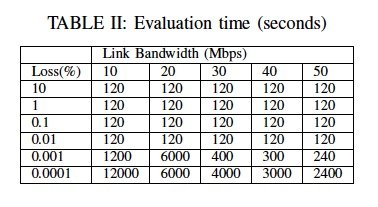

## TCP, QUIC, MPTCP and MP-QUIC  
### Parameters  
- File sizes: 10KB, 100KB, 500KB, 1MB, 10MB, 50MB, 100MB.  
- Link characteristics: bandwidth, delay, jitter, packet loss.  
### Tasks  
1. TCP vs QUIC  
   - Over a single link.  
   - Three types of link: Good link, Not so good link and very bad link.  
   - Based on WiFi and LTE respectively. So six lines in total.  
   - QUIC-Go.  
2. MPTCP vs MPQUIC  
3. MPTCP vs MPQUIC with Link Broken  
4. MPTCP vs MPQUIC with Recovering Link (broken then recovered)

## Notes  
- **RTT**: 
In telecommunications, the round-trip delay time (RTD) or round-trip time (RTT) is the length of time it takes for a signal to be sent plus the length of time it takes for an acknowledgement of that signal to be received.  
- **UDP**: User Datagram Protocol. With UDP, computer applications can send messages to other hosts on an Internet Protocol network. Prior communications are not required in order to set up communication channels or data paths. UDP has no handshaking dialogues, guarantee of delivery, ordering or duplicate protection, so it is unreliable.  
- **QUIC**: Quick UDP Internet Connections. QUIC supports a set of multiplexed connections between two endpoints over UDP and was designed to provide security protection equivalent to TLS/SSL, along with reduced connection and transport latency, and bandwidth estimation in each direction to avoid congestion.  
- **TCP vs QUIC**:  
   - Connection handshake: TCP required a 3-way handshake to establish a connection, and, on top of that, you also need to negotiate the TLS connection. QUIC is built on top of UDP so it requires 1 packet to establish the connection, including TLS. Actually, if the client and the server have spoken in the past, then we are talking about a zero-handshake connection ¨C that happens 75% the time.  
   - Multiplexing: the communication between the client and the server is multiplexed and this overcomes the head-of-line blocking issues that are common with TCP connections.  
- **ICMP**: The Internet Control Message Protocol (ICMP) is a supporting protocol in the Internet protocol suite. It is used by network devices, including routers, to send error messages and operational information indicating, for example, that a requested service is not available or that a host or router could not be reached.  
- When eth1 has no IP address, add the code into `/etc/network/interfaces`
```yml
auto eth1  
iface eth1 inet dhcp
```  
- **Delay**: One-way delay for all packets. The round-trip time is 2\*delay (depends on the network configuration).  
- **Jitter**: How much should delay change between different packets.  
- **Loss**: How frequently are packets dropped, in percent.  
- **Queue size**: How many packets the send queue can hold. When full, the last is dropped.  
## Link Characteristics  
    

- **WiFi**:  
|  Link (WiFi) | Delay (ms) | Bandwidth (Mbps) | Packet Loss (%) |
|:------------:|:----------:|:----------------:|:---------------:|
|   Good Link  |     10     |        50        |        1        |
| General Link |     20     |        30        |        5        |
|   Bad Link   |     30     |        10        |        10       |  

- **LTE**:  
|  Link (LTE)  | Delay (ms) | Bandwidth (Mbps) | Packet Loss (%) |
|:------------:|:----------:|:----------------:|:---------------:|
|   Good Link  |     75     |        50        |        1        |
| General Link |     90     |        30        |        5        |
|   Bad Link   |     110    |        10        |        10       |  

## Mininet Command  
- `sudo mn`: start a minimal topology and enter the CLI for mininet.  
- `mininet> nodes`: show the available nodes.  
- `mininet> net`: show the link information.  
- `mininet> iperf`: testing TCP bandwidth between hosts.  
- `mininet> dump`: export the information of each node.  
- `tcpdump`: To record packets headers and/or data to packet capture files (PCAP-files), including time stamp when each packet was received.  
- `ping/Hping3`: Utilities to send Internet Control Message Protocol (ICMP) echo packets and display round-trip-time, latency and packet loss.  
- `iperf`: Bandwidth measurement utility that can also function as a traffic generator.  
- `nginx`: Web server that supports HTTP and HTTPS.  
- `curl`: Command-line web client.  
- `wireshark`: Utility to graphically and interactively analyze network packets.  
- `tshark`:  Command-line version of Wireshark to analyze and extract packet fields and statistics.
## Run TCP-WiFi.py  
```yml  
cd ~/mininet  
truncate -s 1M (10M, 50M, etc) ~/mininet/1mbfile  
sudo python TCP-WiFi.py  
mininet> h1 cd ~/mininet  
mininet> h1 python -m SimpleHTTPServer 80 &  
mininet> h2 wget http://10.0.0.1:80/1mbfile
```
## Useful Links  
- [WiFi, LTE, or Both? Measuring Multi-Homed Wireless Internet Performance](http://web.mit.edu/ravinet/www/imc_submission.pdf)  
- [An Enhancement of Multipath TCP Performance in Lossy Wireless Networks](https://ieeexplore.ieee.org/document/7856155/)  
- [Multipath TCP in Lossy Wireless Environment](https://pdfs.semanticscholar.org/a9ed/bb069dfabd8d5113e6d8cedc6ec94d86a9b7.pdf)  
- [Analysis of UDP-based Reliable Transport using Network Emulation](http://www.diva-portal.org/smash/get/diva2:1023775/FULLTEXT02.pdf)  
- [Introduction to Mininet](https://github.com/mininet/mininet/wiki/Introduction-to-Mininet#what)  
- [Mininet network simulator review](http://www.brianlinkletter.com/mininet-test-drive/)
